# 📊 Cohort Retention & Poisson Bootstrap A/B Testing

## 📁 Repository Overview

This repository provides Python solutions for two important analytical tasks:

### Cohort Retention Analysis
Calculate user retention rates over time with customizable cohort granularity (daily, weekly, or monthly). This allows you to track how different user groups behave and retain over specific time intervals, enabling deeper insights into user engagement patterns.

### Poisson Bootstrap A/B Testing
Evaluate A/B test metrics — such as Average Revenue Per User (ARPU), Average Revenue Per Paying User (ARPPU), and Conversion Rate (CR) — using Poisson bootstrapping.  
Poisson bootstrap is an efficient variant of traditional bootstrapping that assigns random Poisson-distributed weights to each data point instead of resampling entire datasets. This approach:

- Enables fast, vectorized computations with minimal memory overhead  
- Facilitates parallel processing, making it scalable for large datasets  
- Provides robust confidence intervals and hypothesis tests without strong parametric assumptions

## 🔢 1. Player Cohort Retention Analysis Function

**Retention** measures how many users return to the product after their first experience, helping teams understand user engagement and product stickiness.

**Cohort analysis** groups users based on their start date (e.g., registration date) and tracks their behavior (e.g., logins) over time. This highlights patterns and retention trends within specific user groups, allowing you to:

- Compare different user onboarding cohorts  
- Evaluate product changes by tracking newer vs. older cohorts  
- Identify when churn occurs and respond with tailored actions  

Implementation of cohort analysis allows teams to quantify retention using two core methods:

- **Classic Retention**: Users active in each period after their cohort start  
- **Rolling Retention**: Users who return at least once *after* a given period  

Cohort retention can be visualized in **daily, weekly, or monthly** granularity, and supports both **classic** (discrete period-based) and **rolling** (cumulative) retention calculations.

### 📊 Daily Rolling Cohort Retention Rate

---

### ⚙️ Pipeline Overview

### 🔁 Why It Matters

Implementing retention and cohort analysis allows product teams to:

- Benchmark performance of new player funnels  
- Understand when and why users churn  
- Test the impact of design or difficulty changes  
- Align product decisions with long-term engagement metrics  

> 🔍 **Retention** is not just about *"how many come back"* — it's about **who** comes back, **when**, and **why**.

---

### cohort_retention(reg_data, auth_data, start_date, end_date, cohort_type, number_of_periods, retention_type='classic')

#### ✅ Inputs

| Parameter          | Type       | Description                                             |
|--------------------|------------|---------------------------------------------------------|
| reg_data           | DataFrame  | User registration data with `uid` and `reg_ts` columns  |
| auth_data          | DataFrame  | Authentication data with `uid` and `auth_ts` columns    |
| start_date         | str        | Start date of cohorts (format: YYYY-MM-DD)              |
| end_date           | str        | End date of cohorts (format: YYYY-MM-DD)                |
| cohort_type        | str        | One of: day, week, month, quarter, year                 |
| number_of_periods  | int        | Number of periods to track retention after registration |
| retention_type     | str        | 'classic' or 'rolling' retention calculation            |

#### 📤 Output

Returns a `pandas.DataFrame` where:

- Each row is a cohort (start_date formatted).
- Columns include:
  - `'Cohort'`: Cohort name
  - `'Users'`: Number of users
  - `'0'`: Initial cohort size
  - `'1'`, `'2'`, ...: Retention rates for each period
- Last row: `"All Users"` aggregated retention across cohorts

#### 🧠 Notes

Metadata is stored as attributes in the result:

- `result_df.start_date`
- `result_df.end_date`
- `result_df.cohort_type`
- `result_df.retention_type`

## 🧪 2. Poisson Bootstrap A/B Testing

```mermaid
graph TD
  A[Download CSV from Yandex];
  A --> B[Read ab_test_data];
  B --> C[Initial EDA head, info, unique values];
  C --> D[Check duplicate user_ids per group];
  D --> E[Plot group sizes];
  E --> F[Check for overlapping users];
  F --> G[Revenue Distribution Plot];
  G --> H[Annotate Whales, Dolphins, Minnows];
  H --> I[Revenue Segmentation: Freeloaders → Whales];
  I --> J[Further statistical testing / conclusions];

```

Bootstrapping is a robust statistical method used to estimate the sampling distribution of a statistic by repeatedly resampling the observed data with replacement. It is especially valuable when the theoretical distribution is unknown or when calculating analytical confidence intervals is difficult or impractical.

---

### 🔁 Why Bootstrapping?

In A/B testing, bootstrapping allows us to simulate thousands of potential outcomes of the experiment by creating many pseudo-samples from the observed data. This helps to:

- Estimate confidence intervals for KPIs (like **ARPU**, **ARPPU**, **CR**)
- Perform hypothesis testing without strict assumptions (e.g., **normality**)
- Improve robustness, especially with **skewed revenue distributions** (whales vs. minnows)

---

### 🧮 Poisson Bootstrap in Particular

Poisson bootstrapping is a **memory- and compute-efficient** variant of traditional bootstrap. Instead of explicitly resampling entire datasets, it assigns **Poisson(λ = 1)** random weights to each data point. This makes it ideal for:

- **Vectorized operations**: Efficient row-wise multiplication using NumPy arrays  
- **Parallel computing**: Each bootstrap iteration is independent, allowing distribution across CPU cores or compute nodes  
- **Low memory usage**: Avoids large temporary datasets common in classic resampling  

This method is especially helpful for **large-scale A/B tests** with millions of users and revenue entries.

---

### ⚙️ Pipeline Overview

### `poisson_bootstrap(ab_test_data, B)`

#### ✅ Inputs

| Parameter    | Type       | Description                   |
|--------------|------------|-------------------------------|
| ab_test_data | DataFrame  | Must contain:                 |
|              |            | - `testgroup`: 'a' or 'b'     |
|              |            | - `revenue`: numeric revenue  |
| B            | int        | Number of bootstrap iterations|

#### 📤 Output

A DataFrame with B rows, and the following columns:

| Column                 | Description                           |
|------------------------|---------------------------------------|
| revenue_a/b            | Total revenue per group               |
| count_users_a/b        | Number of users in group              |
| count_paying_users_a/b | Number of paying users                |
| ARPU_difference        | Avg. Revenue Per User (B - A)         |
| ARPPU_difference       | Avg. Revenue Per Paying User (B - A)  |
| CR_difference          | Conversion Rate (B - A)               |

### `bootstrap_result_check(bootstrap_data, alpha)`

#### ✅ Inputs

| Parameter       | Type   | Description                                |
|-----------------|--------|--------------------------------------------|
| bootstrap_data  | Series | Metric difference across bootstrap samples |
| alpha           | float  | Significance level (e.g. 0.05)             |

#### 📤 Output

Prints:

- `Sample mean`  
- `Confidence interval`  
- `Decision about rejecting the null hypothesis`

## 3. Metrics for Evaluating Themed Event Performance in Games

### 3.1. Metrics to Evaluate Event Results
- Participation rate
- Completion rate (players finishing the event)
- Average time to complete
- Average rewards earned
- Retention after event (did players come back after the event?)
- Revenue uplift during event

### 3.2. Impact of Increased Difficulty (Level Regression)
If event mechanics are made more challenging by regressing levels on failure:

- Metrics should include attempt counts per player to track difficulty.
- Failure rates per level.
- Drop-off points (levels where players quit).
- Time spent per level (indicates difficulty).
- Comparison of completion rate before and after difficulty change.
- Player frustration or satisfaction metrics if available (e.g., surveys).

### Metrics Flowchart
This flow visualizes how to evaluate event performance in the game, adjusting metrics based on event complexity (e.g., level regression after failure).

