# 📊 Cohort Retention & A/B Testing Analysis Toolkit

This repository contains Python functions for:

**Cohort Retention Analysis** — Calculate user retention rates over time.
**Poisson Bootstrap A/B Testing** — Evaluate A/B test metrics (ARPU, ARPPU, CR) using Poisson bootstrapping.

## 📁 Contents

cohort_retention(...): Computes user retention by cohort (daily, weekly, etc.).  
poisson_bootstrap(...): Performs Poisson bootstrap for A/B testing metrics.  
bootstrap_result_check(...): Evaluates bootstrap output for statistical significance.  


## 🔢 1. Player Cohort Retention Analysis Function

cohort_retention(reg_data, auth_data, start_date, end_date, cohort_type, number_of_periods, retention_type='classic')

### ✅ Inputs

| Parameter          | Type       | Description                                             |
|--------------------|------------|---------------------------------------------------------|
| reg_data           | DataFrame  | User registration data with `uid` and `reg_ts` columns  |
| auth_data          | DataFrame  | Authentication data with `uid` and `auth_ts` columns    |
| start_date         | str        | Start date of cohorts (format: YYYY-MM-DD)              |
| end_date           | str        | End date of cohorts (format: YYYY-MM-DD)                |
| cohort_type        | str        | One of: day, week, month, quarter, year                 |
| number_of_periods  | int        | Number of periods to track retention after registration |
| retention_type     | str        | 'classic' or 'rolling' retention calculation            |


### 📤 Output

Returns a `pandas.DataFrame` where:

- Each row is a cohort (start_date formatted).
- Columns include:
  - `'Cohort'`: Cohort name
  - `'Users'`: Number of users
  - `'0'`: Initial cohort size
  - `'1'`, `'2'`, ...: Retention rates for each period
- Last row: `"All Users"` aggregated retention across cohorts

### 🧠 Notes

Metadata is stored as attributes in the result:

- `result_df.start_date`
- `result_df.end_date`
- `result_df.cohort_type`
- `result_df.retention_type`


## 🧪 2. Poisson Bootstrap A/B Testing

```mermaid
graph TD
  A[Download CSV from Yandex];
  A --> B[Read ab_test_data];
  B --> C[Initial EDA head, info, unique values];
  C --> D[Check duplicate user_ids per group];
  D --> E[Plot group sizes];
  E --> F[Check for overlapping users];
  F --> G[Revenue Distribution Plot];
  G --> H[Annotate Whales, Dolphins, Minnows];
  H --> I[Revenue Segmentation: Freeloaders → Whales];
  I --> J[Further statistical testing / conclusions];

```



poisson_bootstrap(ab_test_data, B)

### ✅ Inputs

| Parameter    | Type       | Description                   |
|--------------|------------|-------------------------------|
| ab_test_data | DataFrame  | Must contain:                 |
|              |            | - `testgroup`: 'a' or 'b'     |
|              |            | - `revenue`: numeric revenue  |
| B            | int        | Number of bootstrap iterations|

### 📤 Output

A DataFrame with B rows, and the following columns:

| Column                 | Description                           |
|------------------------|---------------------------------------|
| revenue_a/b            | Total revenue per group               |
| count_users_a/b        | Number of users in group              |
| count_paying_users_a/b | Number of paying users                |
| ARPU_difference        | Avg. Revenue Per User (B - A)         |
| ARPPU_difference       | Avg. Revenue Per Paying User (B - A)  |
| CR_difference          | Conversion Rate (B - A)               |

## 📉 3. Hypothesis Testing

This flow visualizes how to evaluate event performance in the game, adjusting metrics based on event complexity (e.g., level regression after failure).

```mermaid
graph TD
  A[Identify Event Type]
  A --> B[Define Goals (Complete Levels, Rewards)];
  B --> C[Evaluate Metrics];
  C --> D[Participation Rate];
  C --> E[Completion Rate];
  C --> F[Time Spent];
  C --> G[Number of Attempts per Player];
  C --> H[Items Collected / Rewards Unlocked];
  A --> I{Was event made harder?};
  I --> J[Yes: Add metrics for Regression Events];
  J --> K[Avg. Level Lost After Failure];
  J --> L[Drop-off Rate Increase];
  J --> M[Frustration vs. Retention Analysis];
  I --> N[No: Continue with standard metrics];
```

`bootstrap_result_check(bootstrap_data, alpha)`

### ✅ Inputs

| Parameter       | Type   | Description                                |
|-----------------|--------|--------------------------------------------|
| bootstrap_data  | Series | Metric difference across bootstrap samples |
| alpha           | float  | Significance level (e.g. 0.05)             |

### 📤 Output

Prints:

- `Sample mean`  
- `Confidence interval`  
- `Decision about rejecting the null hypothesis`